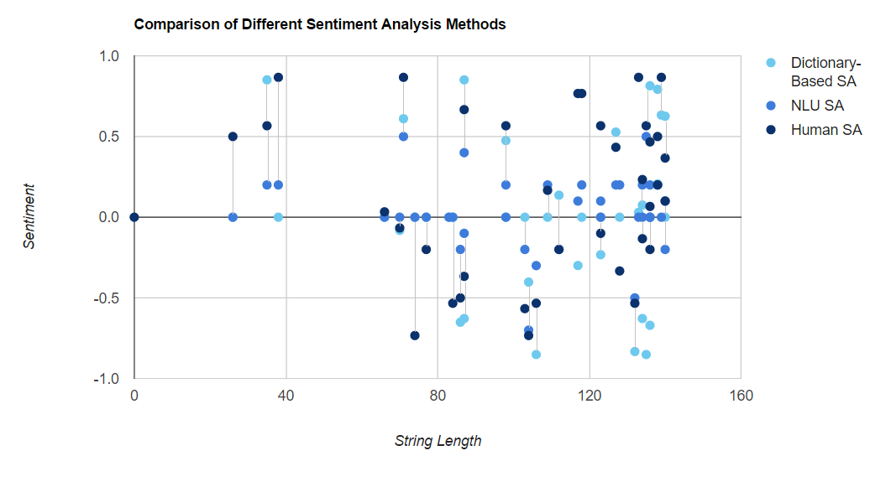
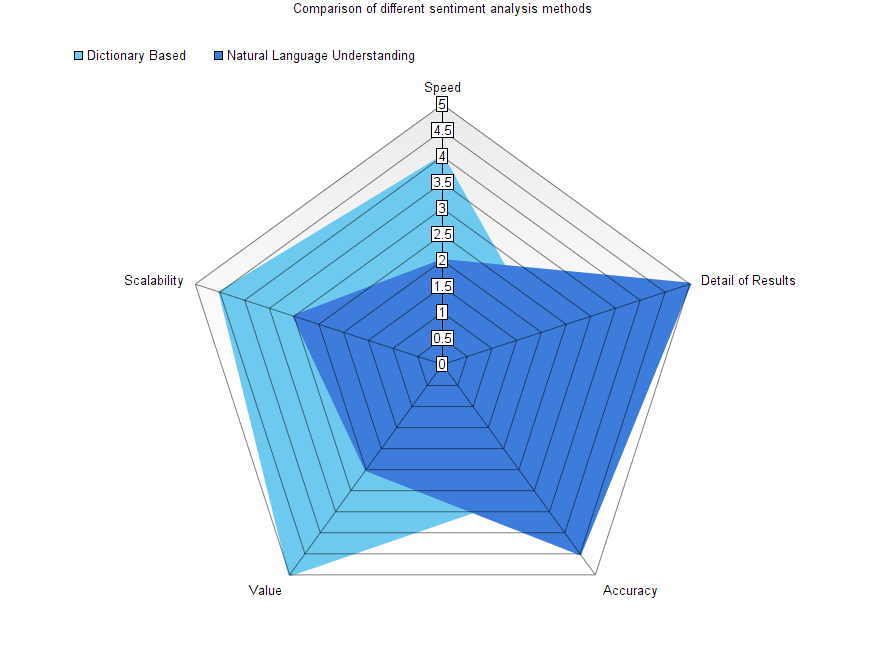

# SENTIMENT ANALYSIS: COMPARING TECHNICAL APPROACHES

## What is Sentiment Analysis?
Sentiment analysis is the process of computationally identifying opinions expressed in a piece of text, to determine the overall attitude conveyed. At its most basic level, this could be resolving the string into an integer score that represents positivity. It can, however, go a lot further, and identify keywords in the text and then compute what the authors feelings and attitudes are towards that topic. The results are of course just subjective impressions and not facts, but with large sets of data can build up a very accurate representation of people’s opinions.
There is a growing demand for SA to make sense of a large amount of data representing people’s opinions. It can be used to understand attitudes conveyed in mass amounts of Twitter data, or to analyse product reviews or to categorise customer emails, to name just a few of its applications.
The purpose of this paper is to carry out some quantitative and qualitative research compares different readily-available methods of SA. The two most common SA methods are dictionary based and natural language understanding based model. As a benchmark the results from both of these will also be compared with human computed values, which are likely to be much more accurate although considerably slower to compute.

## Dictionary-Based Sentiment Analysis
The lexicon-based approach involves calculating orientation for a document from the semantic orientation of words or phrases in the document (Turney 2002). This is usually done with a predefined dataset of words annotated with their semantic values, and a simple algorithm can then calculate an overall semantic score for a given string. Dictionaries for this approach can either be created manually (see also Stone et al. 1966; Tong 2001), or automatically, using seed words to expand the list of words (Hatzivassiloglou and McKeown 1997; Turney 2002; Turney and Littman 2003). 

## Natural Language Understanding Approach 
The natural language understanding (NLU) or text classification approach involves building classifiers from labelled instances of texts or sentences (Pang, Lee, and Vaithyanathan 2002), essentially a supervised classification task. There are various NLU algorithms, the two main branches are supervised and unsupervised machine learning. A supervised learning algorithm generally builds a classification model on a large annotated corpus. Its accuracy is mainly based on the quality of the annotation, and usually the training process will take a long time. Unsupervised uses a sentiment dictionary, rather like the lexicon-based approach, with the addition that builds up a database of common phrases and their aggregated sentiment as well.

 
## Research Plan Methodology
I am going to conduct a research experiment to compare the results produced by natural language understanding (NLU) SA methods to the dictionary based SA approach. There will also be a set of results computed by a human to be used as a benchmark. 

#### The natural language understanding component
The HP Haven OnDemand API is a powerful natural language understanding engine, and will be used for the NLU component. It is free to use for a limited number of requests and provides more details that just an aggregate sentiment score. I have developed a custom wrapper module for this experiment, and the source code and documentation for it can be viewed at https://goo.gl/NTXfyp 

### The dictionary-based component
I have developed a simple dictionary-based algorithm, and have packaged it up as a standalone module, this will be used for the dictionary-based component. For the dataset, it will make use of the AFINN-111-word list, which is a comprehensive list of English words annotated with an integer for valence. The source code and documentation can be viewed at https://goo.gl/gU4f9A 

### The human component
To provide a basic benchmark for results, a survey including a sample of Tweets that will be analysed by the two systems will be drawn up. Participants of the research will be asked to rate each Tweet with a score between 0 (very negative) and 10 (very positive) with 5 being neutral. Since the survey will be considerably more time-consuming than the other two methods, only a sample of the data will be analysed by the five participants.

### Data source
The data source will be Tweets regarding the Edward Snowden case in 2013. The Twitter API will be used to supply the Tweets. I have written and published a custom module to facilitate the easy fetching of relevant Tweets, see https://goo.gl/WQy7gI for source code and documentation.

### Rendering and Displaying Results
Since the results will be dynamic (able to change if a different query is passed in), the charts must be flexible. A combination of Google Charts JavaScript library and a custom module written in D3.js will be used.

> To view the final solution online, and check out the comparison tool for yourself, visit: [http://sentiment-sweep.com/sa-comparison](http://sentiment-sweep.com/sa-comparison)

> There are also links to the documentation from here, and a brief explanation of how it works.

## The Result

### Description of Graph
Each connected point (three or fewer dots, connected with a single vertical line) represents a Tweet. Where each dot is calculated sentiment analysis result, the light blue is dictionary based results, mid-blue is NLU-based results and the dark blue are the benchmark results calculated by humans in the survey. The lines between the points indicate that they were generated from the same Tweet. Some points do not have lines because the dictionary result was exactly the same as the NLU result. The x-axis shows Tweet length (i.e. string length between 0 - 160). The y-axis a measure of overall sentiment, between -1 and +1, where -1 is the lowest possible value, and +1 is the highest possible value.

### Generating the Graph
This graph was rendered using Google Charts and then dynamically modified with a script written in D3.js. Because this graph is dynamic, it is possible for the user to enter any search term, and the system will fetch relevant Tweets, then run the sentiment scripts on those Tweets and generate a similar looking graph. This process is fully automated, and typically takes 5 – 8 seconds.

### Results
There are several findings from this research.

Firstly, there is a clear relationship between the length of the input string (in this case a Tweet) and the accuracy of the results. The longer the input text, the closer together the NLU, dictionary and human results, in most cases. This is because a better understanding of what it being conveyed can be grasped in longer sentences.

The dictionary-based results tended to produce more neutral values, whereas the NLU method was able to distinguish positivity and negativity in most tweets. This is because it is able to interpret actual semantic meaning from the sentence as opposed to just looking and the positivity of words.

The overall average sentiment produced by the NLU dataset for the Edward Snowden dataset was 0.028 (very close to neutral as a lot of very positive and very negative tweets cancelled each other out), and the average for the dictionary based approach was 0.019 (again very neutral). This difference of 0.009 show’s that the two methods, despite being very different overall produced results not that far out.

Finally, there were some cases (on other datasets), where the sentence was using very positive sounding words to convey a sarcastic message. In some cases, the NLU method was able to distinguish this, and gave an appropriate sentiment score, however, the dictionary-based approach failed miserably.

##	Summary of comparison between different SA approaches

The following radar chart illustrates how dictionary-based method compares with the NLU approach. The data was calculated based on the custom written dictionary approach mentioned above, and the HP Haven NLU sentiment analysis engine.

The radar chart illustrates how although NLU SA is significantly more accurate and returns very detailed results, it is certainly not scalable for larger solutions, nor is it fast (hence not suitable for real-time data), and is not cheap to implement and maintain either. 

In conclusion, although the natural language understanding approach is able to deliver more accurate results and distinguish a wider variety of emotions, it takes a lot longer to complete each request, and also requires considerably more computing power, both of which means that it is less cost effective and scalable for larger solutions.
